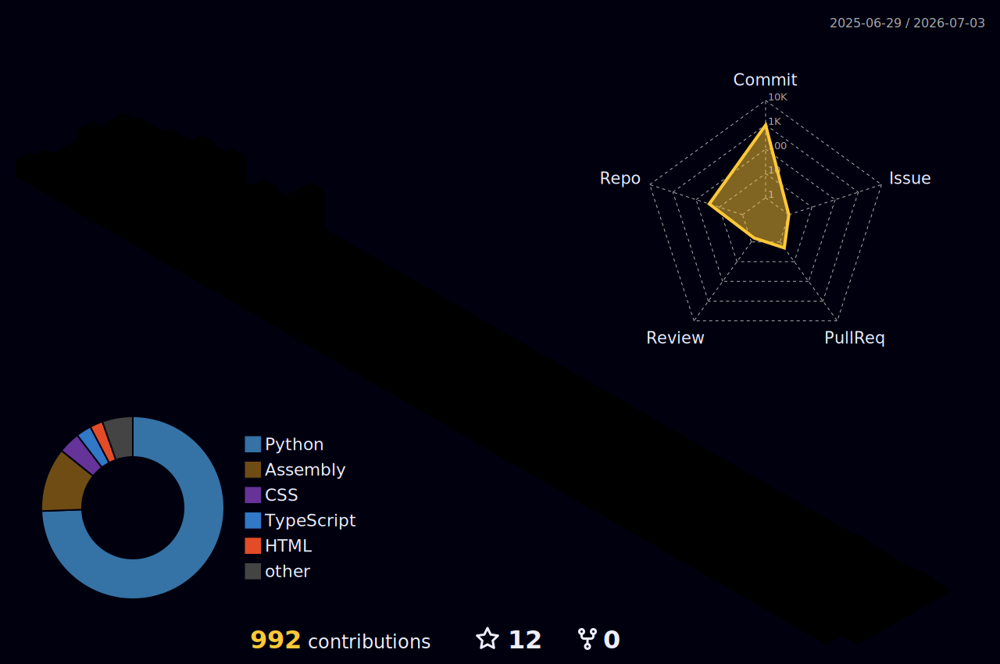

  

 
 

<table width="100%">
<tr>

<td width="58%" valign="top">

<h1 align="center">
  > ℋℯ𝓁𝓁ℴ, <code>&lt;World/&gt;</code> _ &nbsp;
  
</h1>

 

I am a **freelance software developer** deeply invested in the mechanics of **artificial intelligence**. Rather than treating AI as a mysterious vending machine that magically solves everything, I spend an unreasonable amount of time digging into **machine learning architectures**, **model training**, and **deep neural networks** just to understand what is <b><i>actually</i></b> happening under the hood.

Whether I am architecting **SaaS products** or developing **full-stack web applications** for clients, my goal is always the same :- write <b>clean</b>, <b>efficient</b> software while occasionally wrestling with my compiler until it finally agrees with me, and politely negotiating with my AI models so they stop hallucinating.

 

Beyond the screen, I am heavily driven by **technical leadership** and bringing developers together. I spearheaded the inaugural <b>SCICODE intercollegiate fest</b> as head organizer, founded <b>BitCA v2.4</b>, and drove the digital infrastructure for <b>Fiestron 2024</b>.

I strongly believe that building a <b>powerful ecosystem</b> is just as important as building good software because writing code in isolation is fine, but debugging a production crash is much better as a <b><i>team sport</i></b>.

You can usually find me at major **tech meetups**, **hackathons**, and industry summits, getting completely mesmerized by the wild inner workings of <b>Web3</b> <i>(while trying my hardest not to fall down another decentralized rabbit hole)</i> :- all while expanding my network, documenting the tech journey, and collaborating with fellow builders.

 

When I am not debugging applications or organizing tech events, I treat the learning process like a competitive sport. I am currently expanding my creative toolkit through <b>Blender</b>, <b>After Effects</b>, <b>video editing</b>, and <b>3D workflows</b>, with the long-term goal of merging visual creativity with software engineering to eventually venture into <b>game development</b>.

Because honestly... why spend years playing battle royale games when you can eventually just build your own?

</td>

<td width="42%" align="center" valign="middle">

  

  

</td>

</tr>
<tr>
  <td colspan="2" align="center">
     
    

       &nbsp;•&nbsp;   
       &nbsp;•&nbsp;
       &nbsp;•&nbsp;
      
    

     
  </td>
</tr>
</table>

 

  
  
  

#

<h2 align="center">
  
  &nbsp; Technologies, Tools & Creative Chaos I Build With
</h2>

  <i>
    A carefully engineered mixture of low-level programming, modern web stacks, cloud systems, AI tooling, creative software, 
    and technologies discovered somewhere between hackathons and builder communities.
  </i>

 

━━━━━━━━━━━━━━━━━━━━━━━━━━━━━━━━━━━━━━━━

<h3 align="center">
  
  &nbsp;
  Languages & Core Development
</h3>

  &nbsp;&nbsp;&nbsp;
  &nbsp;&nbsp;&nbsp;
  &nbsp;&nbsp;&nbsp;
  &nbsp;&nbsp;&nbsp;
  &nbsp;&nbsp;&nbsp;
  

  &nbsp;&nbsp;&nbsp;
  &nbsp;&nbsp;&nbsp;
  &nbsp;&nbsp;&nbsp;
  &nbsp;&nbsp;&nbsp;
  &nbsp;&nbsp;&nbsp;
  

 

━━━━━━━━━━━━━━━━━━━━━━━━━━━━━━━━━━━━━━━━

<h3 align="center">
  
  &nbsp;
  Frontend, Backend & Application Engineering
</h3>

  &nbsp;&nbsp;&nbsp;
  &nbsp;&nbsp;&nbsp;
  &nbsp;&nbsp;&nbsp;
  &nbsp;&nbsp;&nbsp;
  &nbsp;&nbsp;&nbsp;
  

  &nbsp;&nbsp;&nbsp;
  &nbsp;&nbsp;&nbsp;
  &nbsp;&nbsp;&nbsp;
  &nbsp;&nbsp;&nbsp;
  &nbsp;&nbsp;&nbsp;
  

 

━━━━━━━━━━━━━━━━━━━━━━━━━━━━━━━━━━━━━━━━

<h3 align="center">
  
  &nbsp;
  Cloud, Infrastructure & Databases
</h3>

  &nbsp;&nbsp;&nbsp;
  &nbsp;&nbsp;&nbsp;
  &nbsp;&nbsp;&nbsp;
  &nbsp;&nbsp;&nbsp;
  &nbsp;&nbsp;&nbsp;
  

  &nbsp;&nbsp;&nbsp;
  &nbsp;&nbsp;&nbsp;
  &nbsp;&nbsp;&nbsp;
  &nbsp;&nbsp;&nbsp;
  &nbsp;&nbsp;&nbsp;
  

 

━━━━━━━━━━━━━━━━━━━━━━━━━━━━━━━━━━━━━━━━

<h3 align="center">
  
  &nbsp;
  AI, Data Science & Machine Learning
</h3>

  &nbsp;&nbsp;&nbsp;
  &nbsp;&nbsp;&nbsp;
  &nbsp;&nbsp;&nbsp;
  &nbsp;&nbsp;&nbsp;
  &nbsp;&nbsp;&nbsp;
  

  &nbsp;&nbsp;&nbsp;
  &nbsp;&nbsp;&nbsp;
  &nbsp;&nbsp;&nbsp;
  &nbsp;&nbsp;&nbsp;
  &nbsp;&nbsp;&nbsp;
  

 

━━━━━━━━━━━━━━━━━━━━━━━━━━━━━━━━━━━━━━━━

<h3 align="center">
  
  &nbsp;
  Development Utilities & Engineering Tools
</h3>

  &nbsp;&nbsp;&nbsp;
  &nbsp;&nbsp;&nbsp;
  &nbsp;&nbsp;&nbsp;
  &nbsp;&nbsp;&nbsp;
  

  &nbsp;&nbsp;&nbsp;
  &nbsp;&nbsp;&nbsp;
  &nbsp;&nbsp;&nbsp;
  

 

━━━━━━━━━━━━━━━━━━━━━━━━━━━━━━━━━━━━━━━━

<h3 align="center">
  
  &nbsp;
  Creative Engineering & Design Stack
</h3>

  &nbsp;&nbsp;&nbsp;
  &nbsp;&nbsp;&nbsp;
  &nbsp;&nbsp;&nbsp;
  &nbsp;&nbsp;&nbsp;
  &nbsp;&nbsp;&nbsp;
  &nbsp;&nbsp;&nbsp;
  

 

━━━━━━━━━━━━━━━━━━━━━━━━━━━━━━━━━━━━━━━━

#

<h2 align="center">

&nbsp;
<code>𝙶𝚒𝚝𝚑𝚞𝚋 𝚂𝚝𝚊𝚝𝚜 & 𝙲𝚘𝚗𝚝𝚛𝚒𝚋𝚞𝚝𝚒𝚘𝚗 𝙰𝚗𝚊𝚕𝚢𝚝𝚒𝚌𝚜</code>
</h2>

 

  

  

 

  

 

  

#

    
  <h3 align="center"><code>𝙶𝚒𝚝𝙷𝚞𝚋 𝙰𝚌𝚝𝚒𝚟𝚒𝚝𝚢 & 𝙲𝚘𝚗𝚝𝚛𝚒𝚋𝚞𝚝𝚒𝚘𝚗 𝙼𝚎𝚝𝚛𝚒𝚌𝚜</code></h3>

 

  

 
 
 
 
 

  

 

#

 

  <picture>
    <source media="(prefers-color-scheme: dark)" srcset="https://raw.githubusercontent.com/SiddhaK17/SiddhaK17/output/github-contribution-grid-snake-dark.svg"/>
    <source media="(prefers-color-scheme: light)" srcset="https://raw.githubusercontent.com/SiddhaK17/SiddhaK17/output/github-contribution-grid-snake-purple.svg"/>
    
  </picture>

 

#

<h2 align="center">
  
  Connect, Collaborate & Build Together
</h2>

  <i>
    Always open to meaningful conversations around technology, startups, AI, open-source, hackathons, and ambitious ideas.
  </i>

 

   &nbsp;&nbsp;&nbsp;
   &nbsp;&nbsp;&nbsp;
   &nbsp;&nbsp;&nbsp;
   &nbsp;&nbsp;&nbsp;
   &nbsp;&nbsp;&nbsp;
   &nbsp;&nbsp;&nbsp;
   &nbsp;&nbsp;&nbsp;
  

